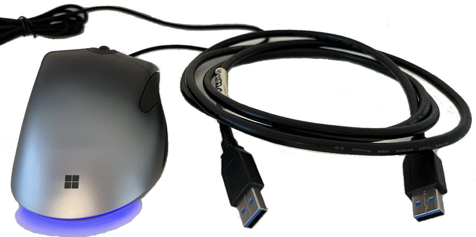

Filter driver for Microsoft Pro IntelliMouse that implements safety checks and exposes a WMI interface. Based on the [KMDF filter driver for a HID device](https://github.com/microsoft/Windows-driver-samples/tree/main/hid/firefly) sample from Microsoft that have been updated to work with more recent IntelliMouse models. The mouse should report itself with `VendorID=045E` (Microsoft) and `ProductID=082A` (Pro IntelliMouse).

### Projects
* `TailLight.sys`: An upper device filter driver for the HID class for Microsoft Pro Intellimouse. Registers a [TailLightDeviceInformation](TailLight/TailLight.mof) WMI class that can be accessed from user mode to control the tail-light.
* `IntelliMouse.ps1`: PowerShell script for sending commands through the WMI interface.
* `flicker.exe`: Application for causing the mouse to blink by sending commands through the WMI interface.
* `HidUtil.exe`: Command-line utility for querying and communicating with HID devices.

Please see the **[wiki](../../wiki)** for additional documentation.

### Prerequisites
* Microsoft [Pro IntelliMouse](https://www.microsoft.com/en/accessories/products/mice/microsoft-pro-intellimouse)
* Separate computer for driver testing. Needed to avoid crashing or corrupting your main computer in case of driver problems.
* USB 3 A/A crossover cable for kernel debugging. Can also use a network connection if the machine has a compatible network adapter.

